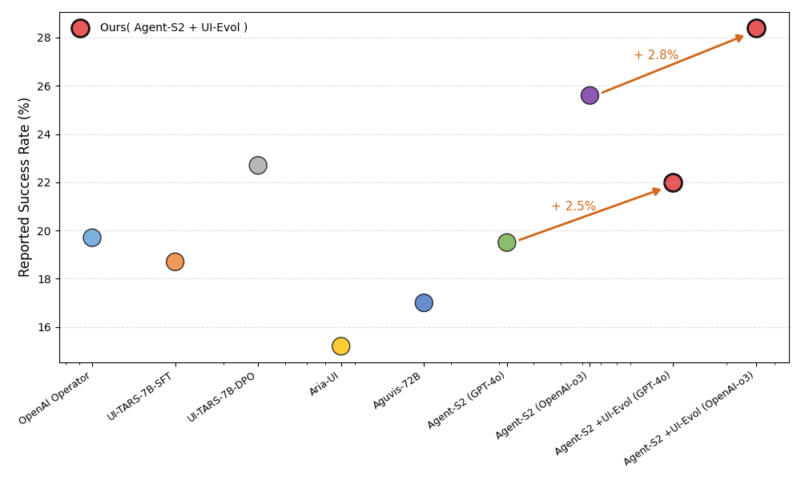

# UI-Evol

UI-Evol is a Python-based framework that leverages Large Language Models (LLMs) to analyze user interface operation trajectories, identify deviations bewteen original knowledge and agent actions , and generate refined knowledge for future use. The system processes trajectory to understand UI operations and provide intelligent feedback for knowledge improvement.

## Main Experimental Results
<div align="center">
  
</div>


## Architecture

The system consists of several core components:

- **Retrace**: Extracts and analyzes UI operations from screenshot sequences
- **Critic**: Analyzes action lists against original knowledge and provides refined knowledge
- **Pipeline**: Orchestrates the analysis workflow
- **BatchProcessor**: Handles bulk processing of trajectory data

## Installation

1. Clone the repository:
```bash
git clone https://github.com/microsoft/E2I-Synth.git
cd UI-Evol
```

2. Install required dependencies:
```bash
pip install -r requirements.txt
```

3. Configure the system by editing `config/config.yaml`:
   - Set your Azure OpenAI endpoints
   - Configure model selections
   - Set appropriate paths for your trajectory data

## Usage

1. Put your knowledge.json to the same path of your trajectory data

2. Run batch processing directly:

```bash
cd src
python batch_processor.py
```

## Example Trace Running

We have prepared a quick example trace collected from OSWorld under /example to fast try our system.

All you need to do is:

1. Prepare environment as mentioned above. (Remember to set YOUR_WORKING_DIR/example as history_path in config/config.yaml)

2. Simply run the batch_processing.py script in /src

3. Wait and See Output from terminal: It will consist of two parts, the Retrace Stage Output followed by "actionlist" and the Critic Stage Output followed by "result".

4. After the process is complete, you can find the full output "result.jsonl" under /example, including all processing log and Final Evolved Knowledge.

## License

This project is licensed under the terms specified in the repository.

## Citation

If you feel our paper or code is helpful, please cite our paper:

```
@misc{zhang2025uievolautomaticknowledgeevolving,
      title={UI-Evol: Automatic Knowledge Evolving for Computer Use Agents}, 
      author={Ziyun Zhang and Xinyi Liu and Xiaoyi Zhang and Jun Wang and Gang Chen and Yan Lu},
      year={2025},
      eprint={2505.21964},
      archivePrefix={arXiv},
      primaryClass={cs.HC},
      url={https://arxiv.org/abs/2505.21964}, 
}
```

